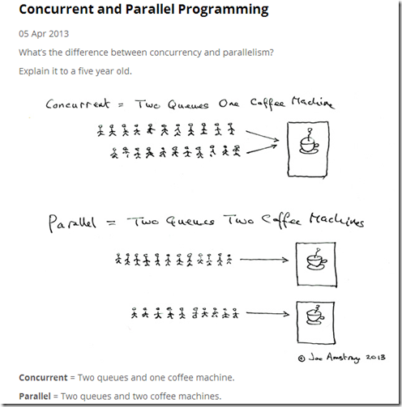
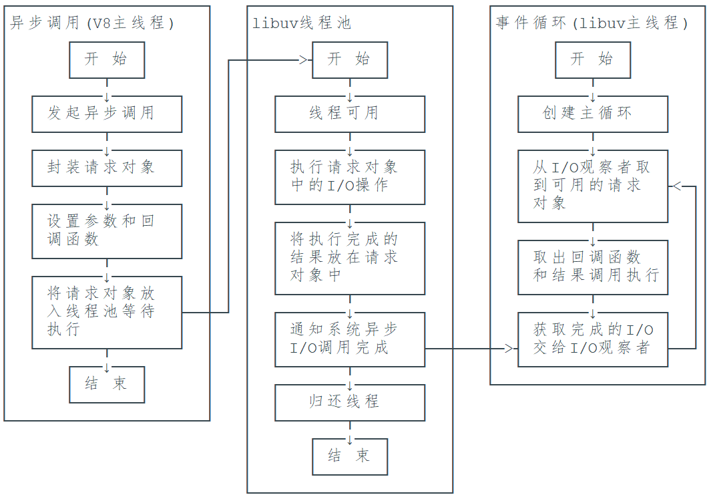
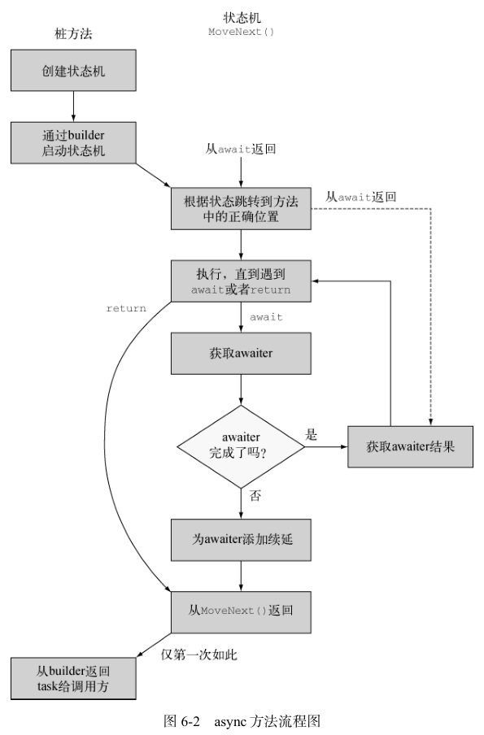

<style>
  :root {
    /* font-size: 24px; */
    font-family: "Courier New", "FangSong";
  }

  strong {
    font-family: "Courier New", "Heiti";
  }
</style>

# Asynchronous Programming
> 异步编程

> 自己捣鼓 + 道听途说, 若有胡诌请立即指正

---

* Toc
  * 并发、并行、同步、异步
  * 异步编程模型
  * `Task`
  * 实现一个简单的`async/await`
  * 一些小坑

---

# Concurrent, Parallel, Synchronous, Asynchronous
> 并发、并行、同步、异步 (咬文嚼字)

---

<center>
  
</center>

---

* 并发: 一个处理器(也可以是多个)在若干任务之间多路复用(M:N线程模型, $M>N$, 突出的就是一个紧张)
* 并行: 每个任务在不同处理器上同时运行(1:1线程模型, 突出的就是一个阔气)

* 同步: 一个一个按顺序来, 上一个没干完下一个要耐心地等
* 异步: 不管上一个干没干完, 就是接着干

* 多线程: 多线程是进程中并发运行的一段代码，能够实现线程之间的切换执行

---

> 并发是在同一时间处理(dealing with)多件事情。
> 并行是在同一时间做(doing)多件事情。

> 异步是目的，多线程只是实现异步的一个**手段**，实现异步不止多线程

> 同步/异步描述的是消息通知的**机制**, 阻塞/非阻塞是描述等待消息通知的**状态**

---

# Asynchronous Programming Model
> 异步编程模型

* OS线程
* 事件驱动
* 协程
* Actor
* async/await

---

## OS Thread
> OS线程

* 最简单, 最直接
* 无需改变编程模型
* 适合少量任务并发/持续运行的CPU密集任务

* 线程间同步坑比较多
* 线程间上下文切换开销较大

---

## Event Driven
> 事件驱动, 常与回调勾结.

* 成也回调

  - 效率很高
  - 实例: `nodejs`由`Google V8 javascript引擎`和`libuv`构成

---

<center>
  
</center>

> [uv_run](https://github.com/libuv/libuv/blob/v1.x/src/unix/core.c#L383)

---

- 败也回调

> 回调地狱

---

  * 《>》
    ``` lua
    local uv = vim.loop

    local read_file = function(path, callback)
        uv.fs_open(path, "r", 438, function(err, fd)
            assert(not err, err)
            uv.fs_fstat(fd, function(err, stat)
                assert(not err, err)
                uv.fs_read(fd, stat.size, 0, function(err, data)
                    assert(not err, err)
                    uv.fs_close(fd, function(err)
                        assert(not err, err)
                        callback(data)
                    end)
                end)
            end)
        end)
    end

    read_file("test.lua", function(data)
        print(data)
    end)
    ```

---

  * 《|》
    ``` lua
    local uv = require("futures").uv

    local read_file = function(path)
        local err, fd, stat, data
        err, fd = uv.fs_open(path, "r", 438)
        assert(not err, err)
        err, stat = uv.fs_fstat(fd)
        assert(not err, err)
        err, data = uv.fs_read(fd, stat.size, 0)
        assert(not err, err)
        err = uv.fs_close(fd)
        assert(not err, err)
        return data
    end

    require("futures").spawn(function()
        print(read_file("test.lua"))
    end)
    ```

---

## Coroutine
> 协程

* 类似线程, 基本无需改变编程模型

* 抽象层次过高, 有点难以微操
* `Golang`使用的是对称协程(`runtime.Gosched`)(没用过),
  `Lua`使用的是非对称协程(`yield`/`resume`)

---

## Actor
> Erlang大杀器(然而并没用过, 下面都是抄的)

* 模型很形象
  * 并发计算被切割成多个单元(`actor`), 它们相互隔离
  * 均异步执行
  * 单元之间通过消息传递的方式进行通信和数据传递

  * Golang: 用消息传递来分享内存，而不是用分享内存来传递消息

---

## async/await
> 西夏普、大蟒蛇、杰艾斯、锈的选择

* 性能高
* 可以微操(自定义运行时, 这个可以有)
* 无需改变编程模型

* 内部实现非常复杂(也不算缺点，毕竟这里掉的头发不是自己的)
* 复杂场景中可能会很迷惑(这里掉的确实是自己的头发)

---

> 这些模型都是要解决什么问题?

---

# Task
> 您找的是不是: Future

> 您找的是不是: Promise

---

* 一个能产出值的异步计算(当然也可以返`void`/`unit`等等)
  ``` rust
  trait SimpleFuture {
      type Output;
      fn poll(&mut self, wake: fn()) -> Poll<Self::Output>;
  }

  enum Poll<T> {
      Ready(T),
      Pending,
  }
  ```

  > 虽然叫`poll`(轮询), 但它没有在傻乎乎地主动定时轮询:
  > 执行器去`poll`走到的`Future`, 如果`Future`完成就继续运行它, 如果`Future`没能干
  > 完就为它注册一个`wake`回调, 切出, `Future`干完的时候通过这个回调让状态机切回,
  > 如此往复直至`Future`运行完成.

---

## `async/await`, what do you do?
> 师傅你是做什么工作的?

* 大概，兴许，差不多
  * `async`提醒编译器要来个状态机
  * `await`报告需要注册回调

---

## Mousukoshi kuwashiku?
> もう少し詳しく?

---

* [0] 创建状态机(状态字段默认为`-1`, 即未运行/运行中)
* [1] `builder`(工具人)启动状态机, 开始`MoveNext`
* [2] 根据状态字段跳转到上一次`await`切出的位置
* [3] 执行、直到遇到`await`或者`return`
* [4] 状态机调用`GetAwaiter`方法来获取一个等待者对象`awaiter`(`TaskAwaiter<T>`),
  并把它压到栈上.
* [5] 状态机查询`awaiter`的`IsCompleted`属性
  * 若`IsCompleted`为`true`, 则操作已经完成;
  * 若`IsCompleted`为`false`, 则操作将以异步方式来完成, 状态机用状态字段($\geq{0}$)记录
    当前位置, 并用一个字段记录`awaiter`.
    `awaiter`调用`OnCompleted`方法并向被传递一个续延委托(用于"唤醒").
    这时`MoveNext`返回, 状态机挂起(让出), 可执行其他任务.
    将来`awaiter`完成时, 续延委托被调用, 再次`MoveNext`, 状态机清理`awaiter`字段, 状态字段变为`-1`
* [6] 调用`awaiter`的`GetResult`方法获取结果, 切至[3]
* [7] 状态机执行完毕后，状态设为`-2`, 设置`Result`.
* [8] GC清场(Debug模式下状态机被创建为`class`以便于调试, 而Release模式下则为`struct`, 离开作用域就扔)

---

<center>
  
</center>

---

## Disassembly
> 聽话, 讓我看看!

---

* Before
  ``` cs
  await Task.Delay(1000);
  Console.WriteLine("1000");
  await Task.Delay(2000);
  Console.WriteLine("2000");
  ```

---

* After
  ``` cs
  // Program
  using System;
  using System.Diagnostics;
  using System.Runtime.CompilerServices;
  using System.Threading.Tasks;

  [CompilerGenerated]
  internal class Program
  {
    // 状态机.
    [CompilerGenerated]
    private sealed class <<Main>$>d__0 : IAsyncStateMachine
    {
      // ...
    }

    // 桩方法.
    [AsyncStateMachine(typeof(<<Main>$>d__0))]
    [DebuggerStepThrough]
    private static Task <Main>$(string[] args)
    {
      // ...
    }

    // Main函数入口.
    [SpecialName]
    [DebuggerStepThrough]
    private static void <Main>(string[] args)
    {
      <Main>$(args).GetAwaiter().GetResult();
    }
  }
  ```

---

  - 桩方法
    ``` cs
    [AsyncStateMachine(typeof(<<Main>$>d__0))]
    [DebuggerStepThrough]
    private static Task <Main>$(string[] args)
    {
      // [0] 创建状态机.
      <<Main>$>d__0 stateMachine = new <<Main>$>d__0();
      // 创建一个builder(勤劳的工具人).
      stateMachine.<>t__builder = AsyncTaskMethodBuilder.Create();
      // 保存参数.
      stateMachine.args = args;
      // 状态设为-1.
      stateMachine.<>1__state = -1;
      // [1] builder启动状态机, 开始`MoveNext`.
      stateMachine.<>t__builder.Start(ref stateMachine);
      // 返回Task.
      return stateMachine.<>t__builder.Task;
    }
    ```
---

  - 状态机
    ``` cs
    [CompilerGenerated]
    private sealed class <<Main>$>d__0 : IAsyncStateMachine
    {
      public int <>1__state;

      public AsyncTaskMethodBuilder <>t__builder;

      public string[] args;

      // 暂存awaiter.
      private TaskAwaiter <>u__1;

      private void MoveNext()
      {
        // ...
      }

      void IAsyncStateMachine.MoveNext()
      {
        //ILSpy generated this explicit interface implementation from .override directive in MoveNext
        this.MoveNext();
      }

      [DebuggerHidden]
      private void SetStateMachine(IAsyncStateMachine stateMachine)
      {
      }

      void IAsyncStateMachine.SetStateMachine(IAsyncStateMachine stateMachine)
      {
        //ILSpy generated this explicit interface implementation from .override directive in SetStateMachine
        this.SetStateMachine(stateMachine);
      }
    }
    ```

---

  - `MoveNext`
    ``` cs
    private void MoveNext()
    {
      int num = <>1__state;
      try
      {
        TaskAwaiter awaiter;
        TaskAwaiter awaiter2;
        if (num != 0)
        {
          if (num == 1)
          {
            awaiter = <>u__1;
            <>u__1 = default(TaskAwaiter);
            num = (<>1__state = -1);
            goto IL_00e1;
          }
          awaiter2 = Task.Delay(1000).GetAwaiter();
          if (!awaiter2.IsCompleted)
          {
            num = (<>1__state = 0);
            <>u__1 = awaiter2;
            <<Main>$>d__0 stateMachine = this;
            <>t__builder.AwaitUnsafeOnCompleted(ref awaiter2, ref stateMachine);
            return;
          }
        }
        else
        {
          awaiter2 = <>u__1;
          <>u__1 = default(TaskAwaiter);
          num = (<>1__state = -1);
        }
        awaiter2.GetResult();
        Console.WriteLine("1000");
        awaiter = Task.Delay(2000).GetAwaiter();
        if (!awaiter.IsCompleted)
        {
          num = (<>1__state = 1);
          <>u__1 = awaiter;
          <<Main>$>d__0 stateMachine = this;
          <>t__builder.AwaitUnsafeOnCompleted(ref awaiter, ref stateMachine);
          return;
        }
        goto IL_00e1;
        IL_00e1:
        awaiter.GetResult();
        Console.WriteLine("2000");
      }
      catch (Exception exception)
      {
        <>1__state = -2;
        <>t__builder.SetException(exception);
        return;
      }
      <>1__state = -2;
      <>t__builder.SetResult();
    }
    ```

---

  - 整理一下
    ``` cs
    private void MoveNext()
    {
      int num = <>1__state;
      try
      {
        TaskAwaiter awaiter;
        TaskAwaiter awaiter2;

        switch (num)
        {
          case 0: goto RESUME_FIRST;
          case 1: goto RESUME_SECOND;
          default: goto START_FIRST;
        }

    START_FIRST:
        awaiter2 = Task.Delay(1000).GetAwaiter();
        if (!awaiter2.IsCompleted)
        {
          num = (<>1__state = 0);
          <>u__1 = awaiter2;
          <<Main>$>d__0 stateMachine = this;
          <>t__builder.AwaitUnsafeOnCompleted(ref awaiter2, ref stateMachine);
          return;
        }
        goto GET_FIRST_RESULT;
    RESUME_FIRST:
        awaiter2 = <>u__1;
        <>u__1 = default(TaskAwaiter);
        num = (<>1__state = -1);
    GET_FIRST_RESULT:
        awaiter2.GetResult();
        Console.WriteLine("1000");

    START_SECOND:
        awaiter = Task.Delay(2000).GetAwaiter();
        if (!awaiter.IsCompleted)
        {
          num = (<>1__state = 1);
          <>u__1 = awaiter;
          <<Main>$>d__0 stateMachine = this;
          <>t__builder.AwaitUnsafeOnCompleted(ref awaiter, ref stateMachine);
          return;
        }
        goto GET_SECOND_RESULT;
    RESUME_SECOND:
        awaiter = <>u__1;
        <>u__1 = default(TaskAwaiter);
        num = (<>1__state = -1);
    GET_SECOND_RESULT:
        awaiter.GetResult();
        Console.WriteLine("2000");
      }
      catch (Exception exception)
      {
        <>1__state = -2;
        <>t__builder.SetException(exception);
        return;
      }
      <>1__state = -2;
      <>t__builder.SetResult();
    }
    ```

---

  - `try`块 - 跳板
    ``` cs
        // ...
        // [2] 根据状态字段跳转到上一次`await`切出的位置
        switch (num)
        {
          case 0: goto RESUME_FIRST;
          case 1: goto RESUME_SECOND;
          default: goto START_FIRST;
        }
    ```

---

  - `try`块 - 启动->[续延]->结果
    ``` cs
    START_FIRST:
        // [3] 执行、直到遇到`await`或者`return`.
        // [4] 状态机调用`GetAwaiter`方法来获取一个等待者对象`awaiter`(`TaskAwaiter<T>`),
        // 并把它压到栈上.
        awaiter2 = Task.Delay(1000).GetAwaiter();
        // [5] 状态机查询`awaiter`的`IsCompleted`属性.
        if (!awaiter2.IsCompleted)
        {
          // [5.2] 若`IsCompleted`为`false`, 则操作将以异步方式来完成
          // 状态机用状态字段记录当前位置
          num = (<>1__state = 0);
          // 用一个字段记录`awaiter`.
          <>u__1 = awaiter2;
          <<Main>$>d__0 stateMachine = this;
          // `awaiter`调用`OnCompleted`方法并向被传递一个续延委托(用于"唤醒").
          <>t__builder.AwaitUnsafeOnCompleted(ref awaiter2, ref stateMachine);
          // 这时`MoveNext`返回, 状态机挂起(让出), 可执行其他任务.
          return;
        }
        // [5.1] 若`IsCompleted`为`true`, 则操作已经完成;
        goto GET_FIRST_RESULT;
    RESUME_FIRST:
        // 将来`awaiter`完成时, 续延委托被调用, 再次`MoveNext`
        // https://referencesource.microsoft.com/#mscorlib/system/runtime/compilerservices/AsyncMethodBuilder.cs,8539e615974ae806,references
        awaiter2 = <>u__1;
        // 状态机清理`awaiter`字段
        <>u__1 = default(TaskAwaiter);
        // 状态字段变为`-1`
        num = (<>1__state = -1);
    GET_FIRST_RESULT:
        // [6] 调用`awaiter`的`GetResult`方法获取结果, 切至(下一轮的)[3]
        awaiter2.GetResult();
        Console.WriteLine("1000");

        // 第二个await.
        // ...
    ```
---

  - 收尾工作
    ``` cs
      catch (Exception exception)
      {
        <>1__state = -2;
        // 设置异常.
        <>t__builder.SetException(exception);
        return;
      }
      // [7] 状态机执行完毕后，状态设为`-2`, 设置`Result`.
      <>1__state = -2;
      <>t__builder.SetResult();
    // ...
    ```

---

## `await` inside a loop or a `try/finally` block?
> 循环/`try/finally`中的`await`

> 总会找到出路(感兴趣可以翻**深入解析C#**)

---

# Implement an `async/await lite`
> 糊一个`async/await青春版`

---

## Ingredients
> 烹饪材料

* 语言:   `Lua`
* 线程池: `libuv`赞助
* 状态机: `coroutine`提供

---

## Steps
> 拢共分几步?

1. 封装一个`Task`类并让它跑起来(`action`: 函数, `vararg`: 参数)
2. `async`: 状态机动起来
3. `await`: 状态机挂起与切回

---

* 国际惯例: Fibonacci数列
  ``` lua
  local fibonacci = function(n)
      local function fib(x)
          if x <= 2 then
              return 1
          else
              return fib(x - 1) + fib(x - 2)
          end
      end

      return fib(n)
  end
  ```

---

* 差不多长这样
  ```
    Thread pool ───────────┬─────────────────┬─── ...
                           │                 │
                        Thread1    MAIN   Thread2
                           │        │        │
                           │        │        │
                           │        │        │
                           │        ┃ <-─────┼─────── `co` is created
                 await --> ├────<-──┨        │
                           │        │        │
                        fib_42      │        │
                           │        │        │
                           │        │        │
           resume `co` --> ├───->───┨        │
                           │        ┠───->───┤ <-- await
                           │        │        │
                           v        │        │
                                    │        │
                                    │     fib_44
                                    │        │
                                    │        │
                                    │        │
                                    │        │
                                    │        │
                                    │        │
                                    ┠────<-──┤ <-- resume `co`
                   `co` is dead --> ┃        │
                                    │        │
                                    │        v
                                    v
  ```

---

# Traps
> 收集一下大家使用.NET异步编程遇到的坑

---

## `async void ...`
> 兜不住

- 无法捕获其中的异常
  ``` cs
  try
  {
    ThrowExceptionAsync();
  }
  catch (Exception)
  {
    Console.WriteLine("Oh, no");
  }

  Console.Read();

  async void ThrowExceptionAsync()
  {
    await Task.Delay(1000);
    throw new InvalidOperationException();
  }
  ```

* 一般用于异步事件处理

---

## Dead Lock
> [死锁指南](https://blog.walterlv.com/)

---

* UI线程死锁经典一例: 同步上下文(`SynchronizationContext`)死锁
  ``` cs
  public partial class MainWindow : Window
  {
    public MainWindow()
    {
      InitializeComponent();
    }

    public void button_Click(object sender, RoutedEventArgs e)
    {
      // Run().Wait();
    }

    private Task Run1()
    {
      return Task.Run(() =>
      {
        Thread.Sleep(1919);
        Console.WriteLine("Hello!");
      });
    }

    private async Task Run2()
    {
      await Task.Run(() =>
      {
        Thread.Sleep(1919);
        Console.WriteLine("Hello!");
      });
    }

    private async Task Run3()
    {
      await Task.Run(() =>
      {
        Thread.Sleep(1919);
        Console.WriteLine("Hello!");
      }).ConfigureAwait(false);
    }
  }
  ```

---

* 同步上下文?
  ```
  Task.UnsafeSetContinuationForAwait:
    if continueOnCapturedContext:
      if SynchronizationContext.Current != null:
        捕获SynchronizationContext并封装进SynchronizationContextAwaitTaskContinuation
        捕获的SynchronizationContext执行回调
      else:
        捕获TaskScheduler并封装进TaskSchedulerAwaitContinuation
        捕获的TaskScheduler执行回调
    else:
      不把回调封装进TaskContinuation
      将回调调度到线程池上运行
  ```

---

* 也可以拿刚才的`async/await青春版`比划比划(`自旋锁`(还是青春版))

---

* Windows消息循环
  ``` cs
  private void Run4()
  {
    var task = Run1();

    var frame = new DispatcherFrame();
    task.ContinueWith(t =>
    {
      frame.Continue = false;
    });

    Dispatcher.PushFrame(frame);

    task.Wait();

    Console.WriteLine("World!");
  }
  ```

---

* 在`lock`中使用`await`?
  > 这这不能

---

  * But... 异步锁(SemaphoreSlim)
    > 其实就是限1个访问名额的信号量
    ``` cs
    SemaphoreSlim mutex = new SemaphoreSlim(1, 1);

    await mutex.WaitAsync();

    try
    {
      await Task.Delay(3000);
    }
    finally
    {
      mutex.Release();
    }
    ```
    > [Rust的异步锁](https://docs.rs/tokio/latest/tokio/sync/struct.Mutex.html)

---

## ...
> 想想还有啥

---

# La Fin

> **参考**
> 1. 深入解析C#, Jon Skeet
> 2. C#并发编程经典实例, Stephen Cleary
> 3. Programming Rust, Jim Blandy
> 4. Lua设计与实现, codedump
> 5. [walterlv](https://blog.walterlv.com/)
> 6. [Rust Course](https://course.rs/about-book.html)
